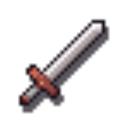
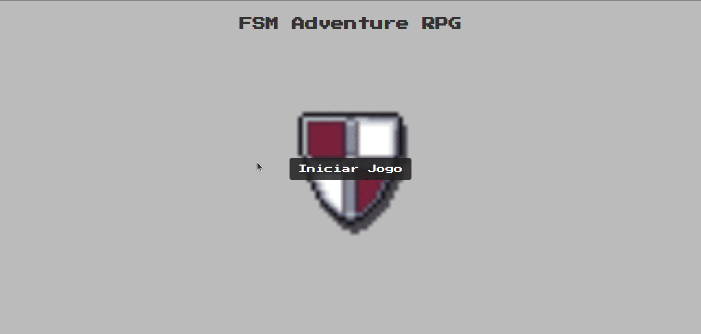

## FSM Adventure RPG

## 🛠 Tecnologias Utilizadas

## 💻 Sobre o jogo

Este é um RPG de aventura onde você luta com diferentes inimigos de diferentes levels em diferentes zonas

## Imagens

As seguintes imagens são utilizadas neste projeto e estão sob a [Licença Creative Commons Attribution v4.0 International](https://creativecommons.org/licenses/by/4.0/):

- Imagem icons-assets.png - Autor: [Shikashi's Fantasy Icons Pack v2](https://shikashipx.itch.io/shikashis-fantasy-icons-pack)

- Imagem sword.png - Autor: [Shikashi's Fantasy Icons Pack v2](https://shikashipx.itch.io/shikashis-fantasy-icons-pack)

## Instalação e execução

1. Faça o download do projeto clicando em **Code** e em seguida em **Download Zip**.

2. Extraia a pasta zipada.

3. Execute o arquivo `index.html`.
